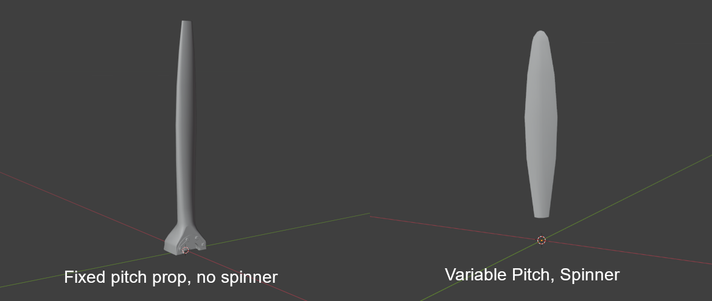
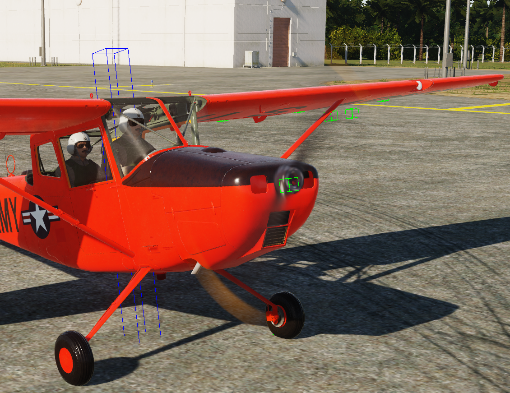

# Prop Blur

## Model Setup

To configure Prop Blur, animate your model as required with these args:

| Arg  | Description             | Values   | Animation                        |
|------|-------------------------|----------|----------------------------------|
| 407  | Prop Rotation           | -1 to 1  | 720° anticlockwise               |
| 413  | Prop Pitch              | Varies   | Reference TF-51 or F4-U          |
| 475  | Prop Blade Visibility   | 0 to 1   | Blades only visible at 0         |

Next, Copy your prop mesh to another blender file (or max) and align the center of the prop with the origin of the model.

Then remove most of the mesh, leaving only one blade of the prop. This can vary depending on the type of prop, see two examples below.



Ensure the prop has only one material, and the material name matches that of the props material in your main EDM, this will give your prop blur the same texture as your blades.

Export this file as an .FBX file, and place the file in your shapes folder (or any mounted shape folder in your project), then move to the next step.

---

### Texturing advice

!!! Note
    The below is from Mag3's 3D artist, who very kindly spilled the beans on how to make the blur look so good :-)

Many factors involved really.   The F4U has variable pitch blades, with a diameter of roughly 13 feet.  Kind of gives that thickness look at all angles.

Secondly, ensuring the same material applied in the EDM is identical to the FBX.  PBR color values should correct too.

For black, check in ModelViewer to see blue (push F8 function key)
Except for weathering effects that may cause it to look blue, it needs to be closer to black or a deep dark blue for flat/dull coated objects.
Using the HSB values, set it to 0*, 0%, 17% and go from there.

If pink or orange, they need adjusted too.  Pure colors should look grey (F8) in ModelViewer.

Try to keep saturation away from 100%, and any 100% RGB values are not great for the shader.
HSB, Orange: I recommend,  13*, 80%, 65% - 75%.  It will look dark on texture, but that is ok. 
HSB, White: 0*, 0%, 65% - 74%

Lastly, the collision model's Arg # for rotation should be 370  |  0...1  |  360*, while the main model is 407.

---

## Lua Setup

In your `plane.lua`, you need to define `propellorShapeType` and `propellorShapeName` as below

```lua
O1_BirdDog =
{
	Name 				=   'O-1E',
	DisplayName			= _('O-1E Bird Dog'),

	Shape 				= "O-1E",
	propellorShapeType  = "3ARG_PROC_BLUR",
    propellorShapeName  = "o1_blade.fbx",
```

Also be sure to define these fields in your `SFM_Data/engine` table:
```lua
prop_direction      = 1,    -- pos rotates cw looking fwd neg is ccw
prop_pitch_min      = 26.0, -- prop pitch min, degrees
prop_pitch_max      = 82.0, -- prop pitch max, degrees
prop_pitch_feather  = 90.0, -- prop pitch feather position, degrees if feather < prop_pitch_max no feathering available
prop_blades_count   = 2,
prop_locations      = {
	{2.257, 0.03558, 0},    -- roll, yaw, pitch angle in tangent value
},
```

### 3ARG_PROC_BLUR

!!! Note 
    * I haven't tested this with pitch, only a fixed pitch prop.
    * The below references a blur sheet, I have not been able to get this in modelviewer, but you can test in game.

3ARG_PROC_BLUR expects three draw args in the model:

| Arg | Function                          | Description                                 |
|-----|-----------------------------------|---------------------------------------------|
| A   | RPM / Phase                       | Drives rotation/blur amount                 |
| B   | Blur Visibility / Blend           | Swaps blade → blur as RPM rises             |
| C   | Aux / Alpha                       | Extra control for the blur sheet            |

If those args don’t exist or are stuck high in the EDM, you’ll see a permanent disc. Quick checklist in ModelViewer (EDM):

Confirm the prop uses 3 separate draw arguments. Spin RPM in the animation panel and check all three change.

Ensure there is a static blade mesh and a blur sheet; the visibility of each is bound to those args (blade visible at low RPM, blur visible only above threshold).

---

### 2ARG_BLUR

If you only have a blur sheet (no static blades), it will always look like a disc at zero RPM.
If you don’t need the 3-arg system, switch to a simpler mode in Lua, e.g.:

propellorShapeType = "2ARG_BLUR"
…and wire just two draw args in the EDM (static/blur). But the real fix is correcting the EDM arg bindings so 3ARG works.

For AI-only aircraft where the prop is just for looks, the easiest is:
propellorShapeType = "static"
propellorShapeName = "tbm_avenger_blade.FBX"

That way, DCS just draws the prop mesh as-is with no argument-driven blur.
It’ll look like a stationary prop at all times — no fake spin — but it avoids the “perma-disc” issue entirely.

Use 1ARG_BLUR and bind it to any available dummy arg in shape_table_data (doesn’t even need to move).
Or keep it static and make a blurred texture for the mesh so it always looks like a “motion smear”.

If you want it to actually switch from blades → blur when spinning, you’ll need to add two prop arguments in the EDM in ModelViewer / 3ds Max:

One arg hides the static blades at speed.
One arg shows the blur mesh at speed.

That’s the 2ARG_BLUR setup, and it’s the simplest dynamic one DCS supports.

---

## EFM Setup

You will need to add the below code to your main cpp file with all your other `ED_FM` functions.  
Specifically inside `ed_fm_get_param`.
Setting thse properly will get the prop blurring nicely


```cpp
switch (index)
	{
	case ED_FM_ENGINE_1_THRUST: // Thrust of engine in newtons, [N]
		return Prop.getThrust();
	// case ED_FM_ENGINE_1_RELATED_THRUST: /// Related thrust in relation to "max" or also called "dry thrust" thrust of that engine
	// 	return ??? for now, idk what max thrust is right now;

	case ED_FM_ENGINE_1_RPM: 			// Engine Fan RPM (fan RPM for turbofan, propeller RPM for turboprop, etc.)
	case ED_FM_PROPELLER_1_RPM:			// Propeller RPM, for helicopters this is main rotor RPM
	case ED_FM_ENGINE_1_CORE_RPM:  		// 0..RPMmax Engine and prop sound
		return Engine.getRPM();
	case ED_FM_ENGINE_1_RELATED_RPM:    // [0-1]
    	return Engine.getRPMFraction();
	case ED_FM_ENGINE_1_CORE_RELATED_RPM:  // [0-1] displayed as RPM% in 2D F2 view
		return Engine.getRPMFraction();
	case ED_FM_ENGINE_1_FAN_PHASE:      // [0 - 2pi] Required to get the arg 407 to trigger the spin at low RPM
		return Prop.getFanPhase();
	}
```
!!! Note
    * See `FM/wHumanCustomPhysicsAPI.h` in the EFM API for more detailed descriptions of these.
    * Some engines have different engine RPMs and Prop RPMs, so the values you set to the params above may need to vary
    * `Prop.getThrust();` these functions in the above code are custom, pulling data from my simulation, and are not built in.

---

##  The Result
If you've done the above correctly, you should see something similar to this.

