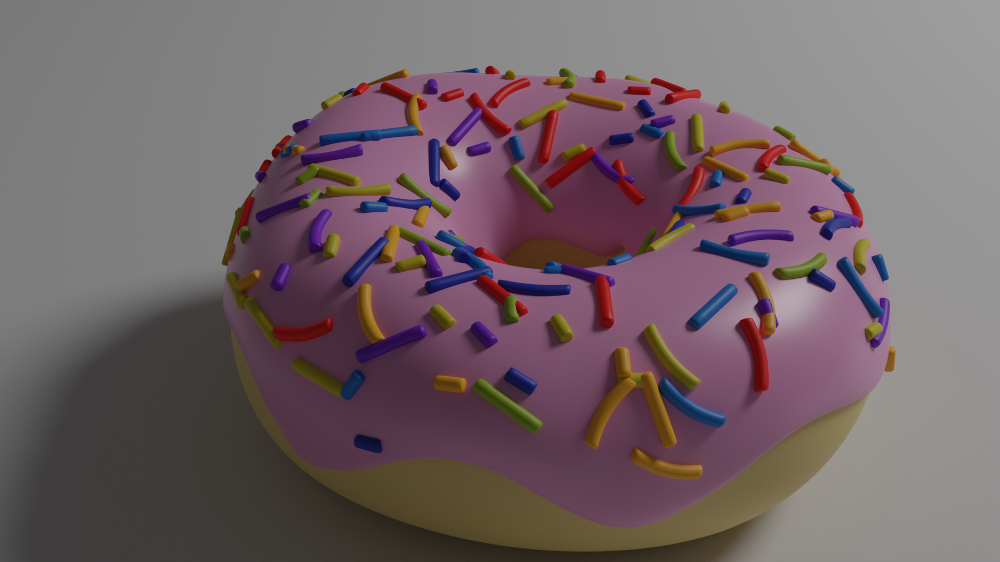
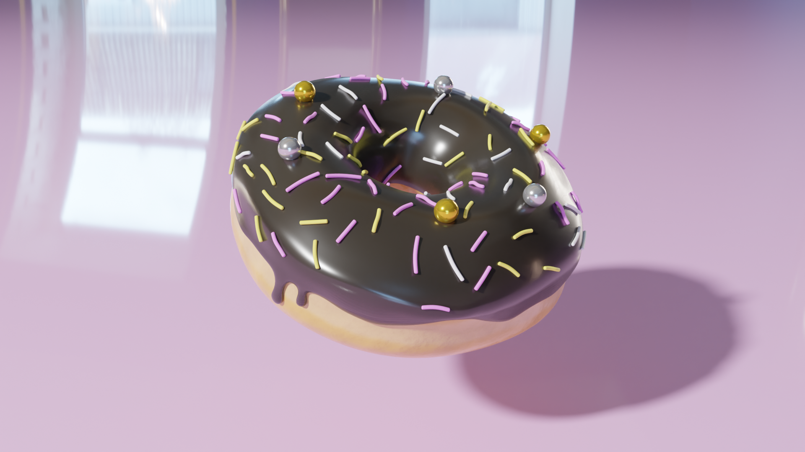
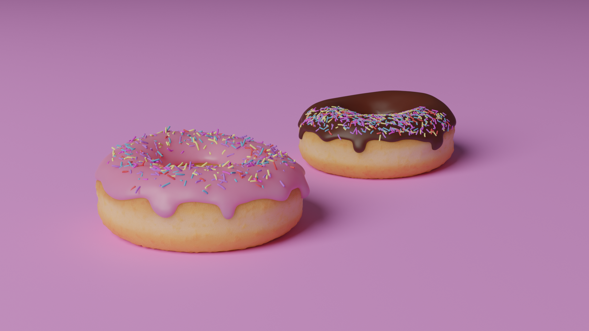

# 3D Modelling

This Section covers what you need to create your models, and get them DCS Ready.

You can use either [Blender](#blender) or [3DS MAX](#3ds-max)

## Blender

### Creating your model

#### The Donut
For those new to blender, the first step should be to make a donut. [This tutorial](https://www.youtube.com/watch?v=4haAdmHqGOw){:target="blank"} is the industry standard for beginning the blender journey. Plenty of modders have begun their journey this way, below I have pulled some images from the modding hub discord.

| Hayds_93's Donut  | JD Leifting's Donut   | Vector's Donut   |
|-------------------|-----------------------|------------------|
|  |  |  |

#### Creating your plane

Once you have an undertanding of the blender process, You can begin making your aircraft.  
Multiple approaches can be used to get the shape of your plane, from 3 angle projection drawings, 3D scans, or even photos.

Youtube is full of blender tutorials for just about everything, and in this phase nothing is DCS Specific

#### Exporting to DCS

There are two blender exporters for DCS.

* Eagle Dynamics EDM Exporter
    * Supports up to 4.2.3 (at time of writing, September 2025)
    * Material Based
* The original EDM-Exporter by Tobsen
    * Supports up to Blender 3.6.x
    * Armature based

!!! Warning
    At time of writing, Tobsen's exporter has been taken down, and is no longer supported.

This guide will use the Eagle Dynamics Exporter, Documentation for this can be found [here](/EDM-Export/Overview/#introduction)

---

## 3DS MAX