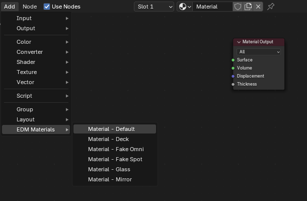
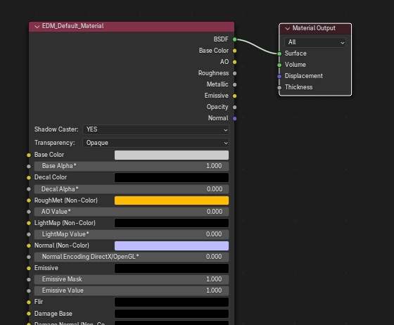
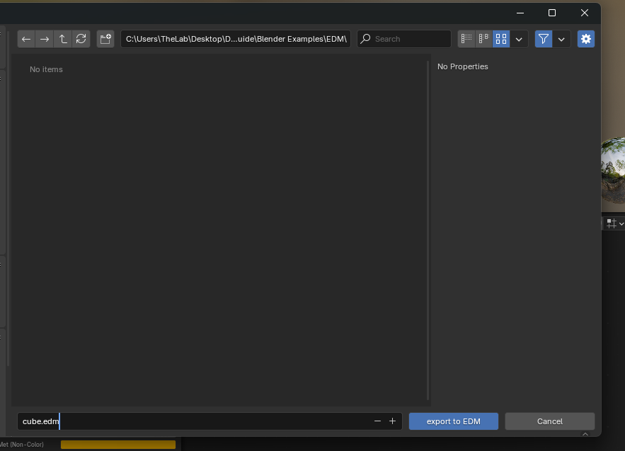

# Exporting A Mesh to DCS

## Preparing the Material
To export your first mesh into the .edm format, start with a blank blender cube, as seen below.

Switch to the shading tab, if the cube does not have a material by default, create one.

Next, We will need to configure the material nodes with the EDM Materials.

First, remove the default *Principled BSDF* node, but **leave** the *Material Output* Node.

Next, Either by pressing `SHIFT + A` or by clicking `Add` in the Node Editor, navigate to EDM Materials > Material - Default.

With the *EDM_Default_Material* Node in place, connect the BSDF point of the EDM material to the Surface point of the *Material Output*. An example of this can be seen below.

---

## Exporting to EDM
We're now ready to export our cube to an .edm file!  
Navigate to `File > Export > Eagle Dynamics Model (.edm)`  
Then Name and save your file in your desired location by clicking *export to EDM*

## Opening in ModelViewer
Open ModelViewer, and go to `File > Load Model` or `CTRL + N`  
Navigate to your edm file, select it, then press load

You should now see a white cube, very similar to the image below.

