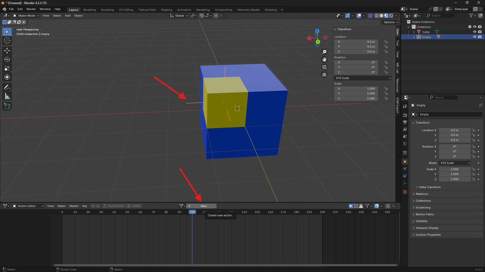
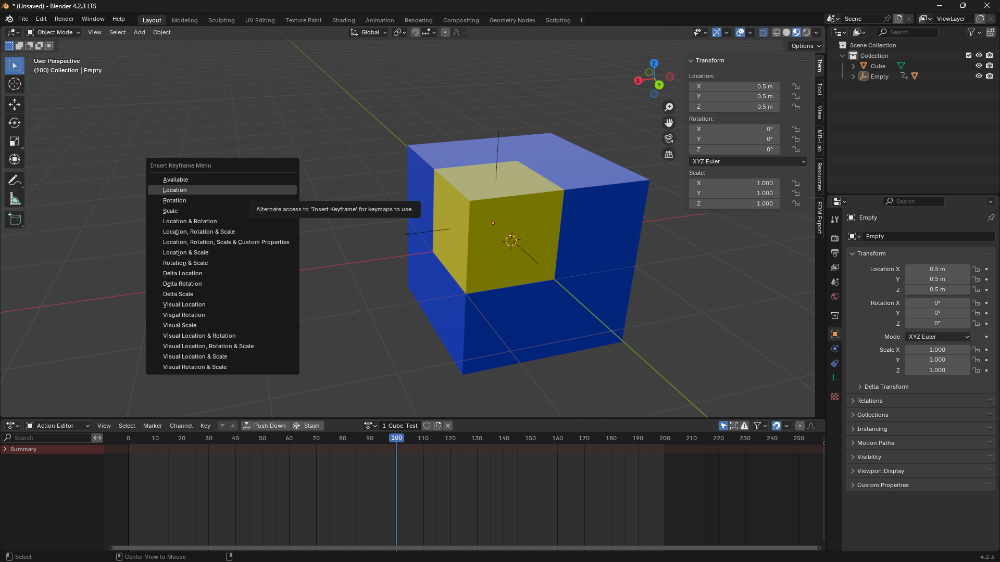
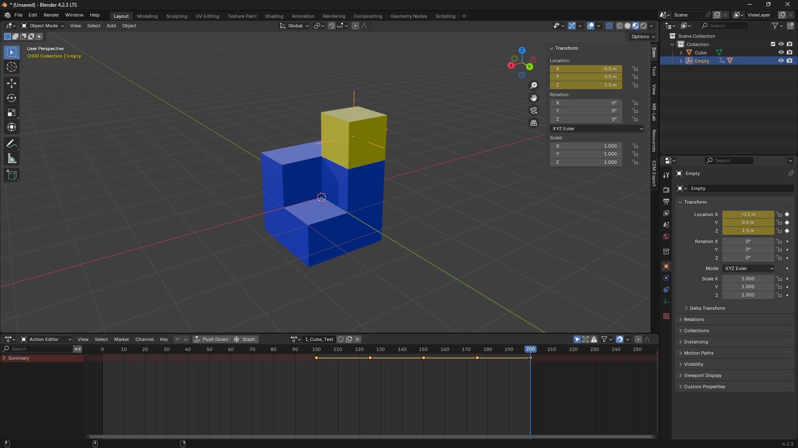
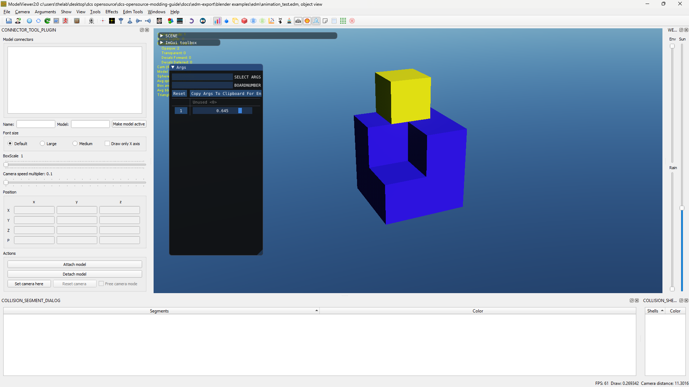
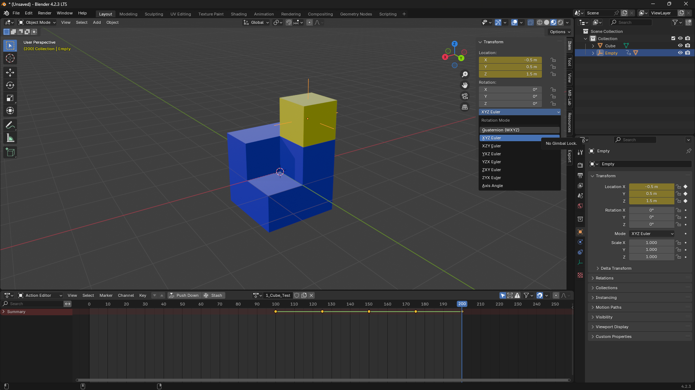

# Animations

## Basic Setup

### Timeline

Open the EDM Export Properties Panel, and click the reset button.  
This will configure blenders timeline into the required format.

You should now see the timeline change to a range of 0-200, and the timeline marker snap to 100.  

For DCS animation, I reccomend the Action editor, which can be found by selecting the dope sheet, then changing the mode to Action Editor.

### Default Interpolation
The EDM format treats the space between keyframes as linear, although by default, blender does not.  
To change this, navigate to `Edit > Preferences` then select `Animation` then change `Default Interpolation` to `Linear`

### Before you start animations

It is important to apply rotation and scale before starting animations. Location does not need to be applied.

!!! Warning
    If you don't do this, you may find the resulting export have some strange translations that are not visible in blender.

---

## Creating an Animation

Create an Empty at a relevant point on the object you want to animate, such as an axis of rotation, or the center of an object.

Parent the mesh to be animated to the empty with `CTRL + P` -> `Object`.

Select the empty, then click on the `New` Button at the top of the action editor.

Name the Animation Action (by clicking the textbox that replaced the new button) to the desired arg number, then an underscore, then a description.  
For example `1_Cube_Test` will add the animation to arg 1 in the edm file. **The desired arg number must be first in the name, anything after it makes no difference**

Next, with the timeline slider at 100 *(DCS Arg value 0)*, press `K` (Blender 3.6 uses `I`) and insert a keyframe of your desired type.

Next, move the timeline slider to 200, *(DCS Arg value 1)* and place another keyframe. You can also add others in between like the image below

Export to EDM, and open your file in modelviewer and you should see your mesh, with a window labeled `Args` with your animation as a slider. Drag the slider to test your animation

!!! Warning
    **Rotation Animations**  
    If you are doing a rotation animation, ensure you set the rotation to `Quaternion (WXYZ)` (as seen in the image below) **Before** adding any keyframes, otherwise you may notice non matching rotation in your EDM file. 
    
    When doing a 180 degree or greater rotation, make sure to do keyframes at 90 degree intervals, otherwise your rotation may go the wrong direction

    

### Download Demo File

**Animation Test**  
[animation.blend](Blender%20Examples/Blend/animation.blend)

---

## Skin Animations

Hooray, ED added support for NLA tracks and multiple args per armature, documentation to come later

!!! Warning
    * Max 4 bones per deforming mesh
    * Need to manually Define a bounding box or won't export