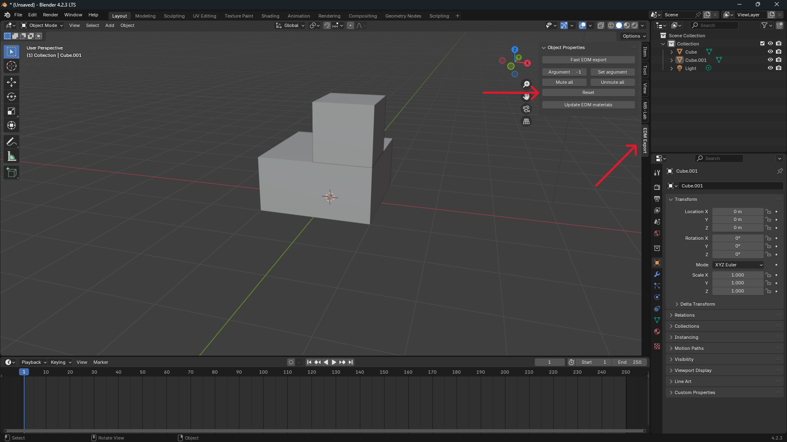
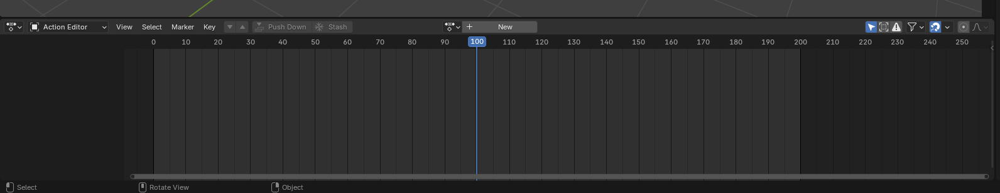
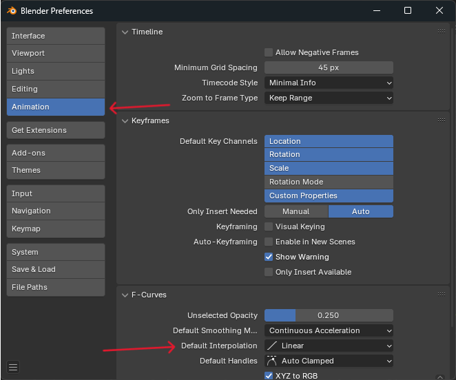

# Animations

## Basic Setup

### Timeline

Open the EDM Export Properties Panel, and click the reset button.  
This will configure blenders timeline into the required format.

You should now see the timeline change to a range of 0-200, and the timeline marker snap to 100.  

For DCS animation, I reccomend the Action editor, which can be found by selecting the dope sheet, then changing the mode to Action Editor.

### Default Interpolation
The EDM format treats the space between keyframes as linear, although by default, blender does not.  
To change this, navigate to `Edit > Preferences` then select `Animation` then change `Default Interpolation` to `Linear`

## Before you start

It is important to apply rotation and scale before starting animations. Location does not need to be applied.

!!! Warning
    If you don't do this, you may find the resulting export have some strange translations that are not visible in blender.

## Skin Animations

!!! Warning
    Max 4 bones per deforming mesh