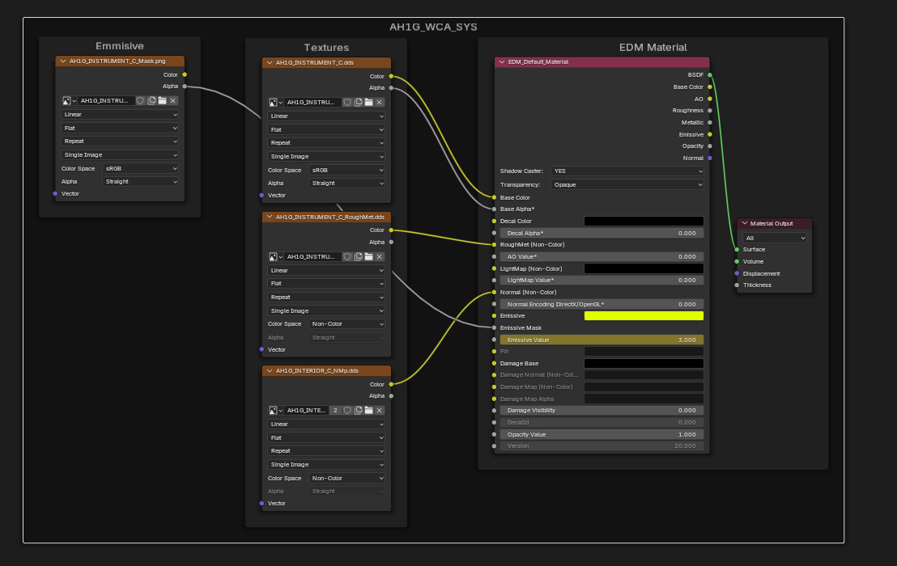

# Materials

Materials serve as the core function of exporting to EDM, there are 6 different materials, of varying use.

| Material | Description |
| --- | ---- |
| [Default Material](#default-material-node) | Most Common, all solid meshes will have this |
| [Glass Material](#glass-materials) | Transparent Meshes, such as instrument glass, or Canopies |
| [Mirror Material](#mirror-materials) | Only applied to the surface of the mirror |

## Default Material Node

### Default Setup

!!! Note
    Setting the `Color Space` fields of the RoughMet and Normal nodes to `Non-Color` will make blender render the textures properly.  
    However not setting this will not affect the resulting edm export, so can be safely ignored

### Emmisive Textures

Emissive Textures are an extension of the default materials

This is the node setup for making backlit panels etc. the emmisive mask is a texture with an alpha map that is white where light passes through. Examples of this can be seen in the demo files in the plugin.

This brightness can be animated, again see the demo files.

!!! Note
    TODO Flesh this out, including animations, note that animations are per mesh, not per material, which is handy

---

## Glass Materials

Below is an example of the glass material node. The glass material node takes the same 3 textures as the [default material](#roughmets-and-normals)

!!! Warning
    Note the Base Colour goes to diffuse colour, not Glass Colour, (At time of writing I am unsure what Glass Colour does, but there is an example in the plugins demo files)

---

## Mirror Materials

---

