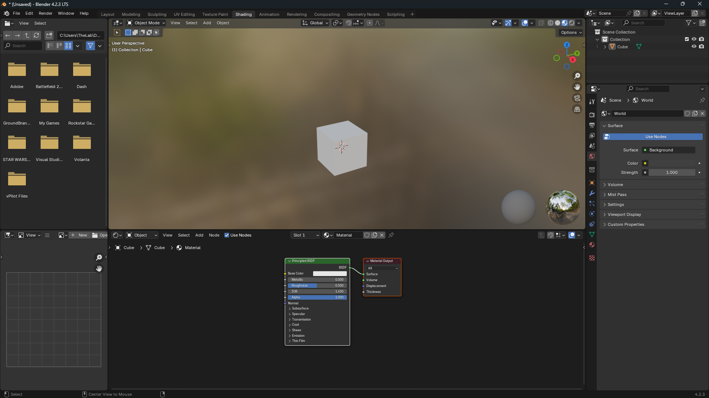
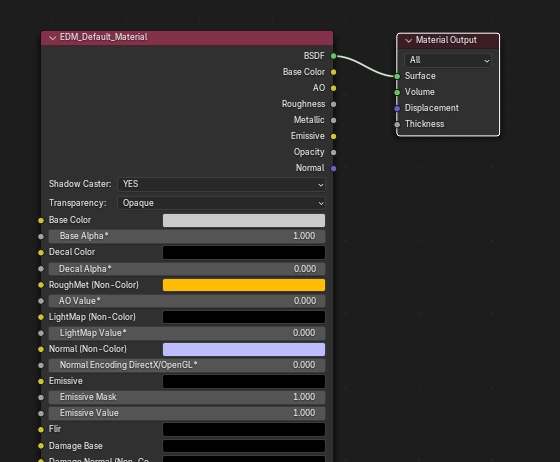
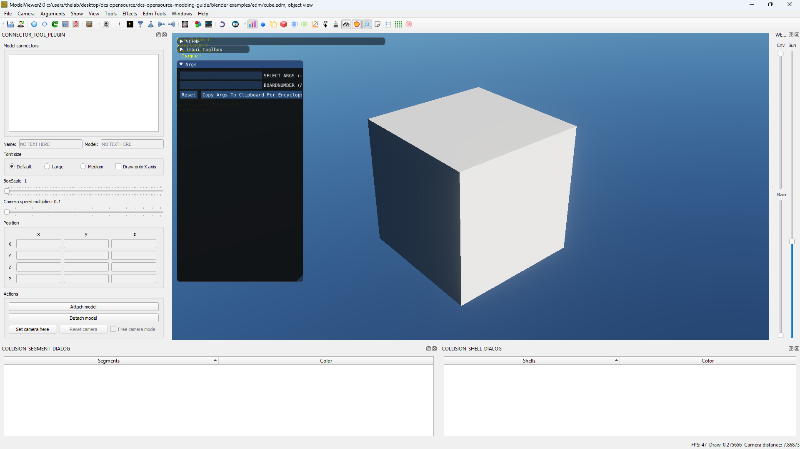
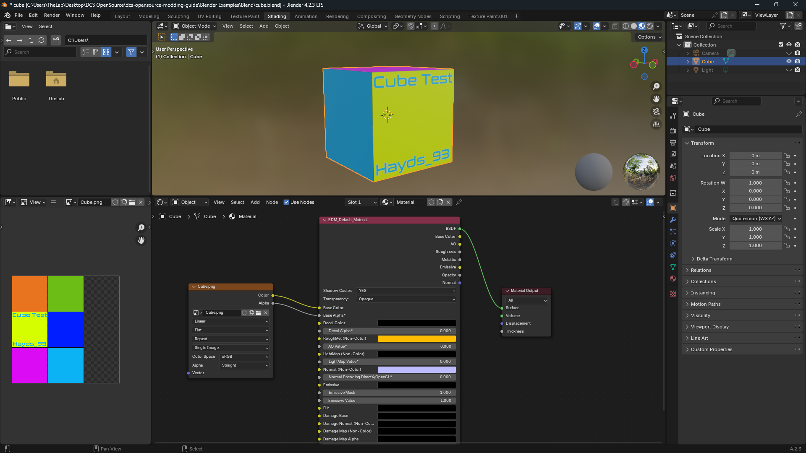
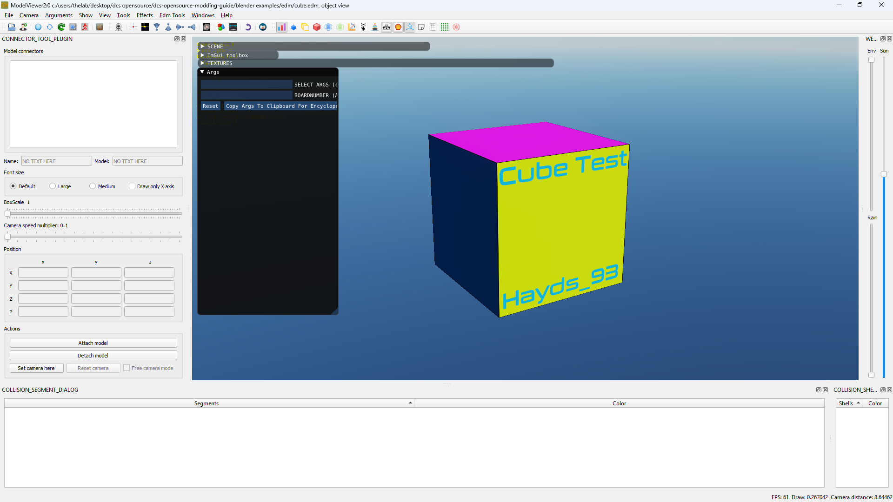
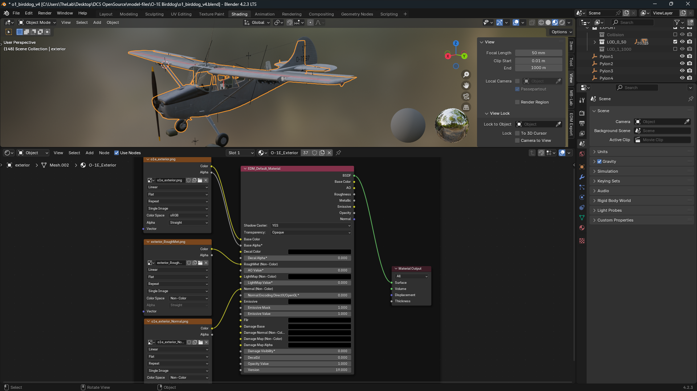
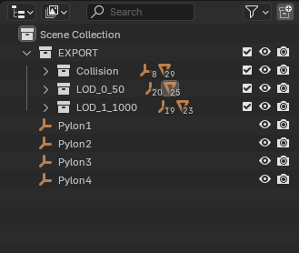

# Exporting A Mesh to DCS

## Preparing the Material
To export your first mesh into the .edm format, start with a blank blender cube, as seen below. 

The "Front" of your model faces positive X, so be sure to face the nose of your vehicle or aircraft towards positive X.


!!! Note
    Make sure your mesh has its Rotation and scale applied, this can be done by selecting your mesh, pressing `CTRL + A` and selecting `Rotation and Scale`


Switch to the shading tab, if the cube does not have a material by default, create one.



Next, We will need to configure the material nodes with the EDM Materials.

First, remove the default *Principled BSDF* node, but **leave** the *Material Output* Node.

Next, Either by pressing `SHIFT + A` or by clicking `Add` in the Node Editor, navigate to EDM Materials > Material - Default.


With the *EDM_Default_Material* Node in place, connect the BSDF point of the EDM material to the Surface point of the *Material Output*. An example of this can be seen below.



---

## Exporting to EDM
We're now ready to export our cube to an .edm file!  
Navigate to `File > Export > Eagle Dynamics Model (.edm)`  
Then Name and save your file in your desired location by clicking *export to EDM*


## Opening in ModelViewer
Open ModelViewer, and go to `File > Load Model` or `CTRL + N`  
Navigate to your edm file, select it, then press load


You should now see a white cube, very similar to the image below.



## Multiple Meshes/Materials
Any object with an EDM material assigned will export to DCS, if you add a second mesh, assign either your existing EDM material, or add a new one, and it will export to DCS

## Multiple Materials per Mesh
The ED Exporter supports multiple materials per mesh, there is nothing special needed to setup, just all materials in the mesh need to be configured to be EDM materials.

## Adding a Texture
Back in the node editor, go to `Add > Texture > Image Texture`  
Then connect the Color and Alpha points on the image texture to the Base Color and Base Alpha points of the EDM Material  
Select your image in the Image Texture Node. Your project should look similar to the image below.



repeat the steps in [Exporting to EDM](#exporting-to-edm)  
Then close and re-poen modelviewer, and reload your EDM file



!!! Warning
    Textures will not appear in ModelViewer unless they are properly mounted. 

A typical working directory structure is: (if this doesnt work, send Hayds_93 a DM on discord and I'll update it)
    
```
Project/
├─ Shapes/
│   └─ cube.edm
└─ Textures/
    └─ cube.png
```


## RoughMets and Normals

Adding RoughMets and Normals is simple.  
Add two more Image Texture nodes.  
Connect the color point of one to *RoughMet (Non-Color)* and the color point on the other to *Normal (Non-Color)*  
The result should look like:



Export your model, restart modelviewer, then load in your new model.

!!! Note
    Setting the `Color Space` fields of the RoughMet and Normal nodes to `Non-Color` will make blender render the textures properly.  
    However not setting this will not affect the resulting edm export, so can be safely ignored

## Blender Project Structre

While not necessary, you can bake all LODs (Level of Detail) and the collision model into one .edm file.



Starting with an `EXPORT` Collection, then having sub-collections for collision, and `LOD_{LOD_NUMBER}_{LOD_DISTANCE_IN_M}` (eg. `LOD_0_50`).
Each sub collection should have a copy of the mesh, and they should not share animations or parents. Duplicate the animation empties, then re-apply the actions to the new empties.

---

