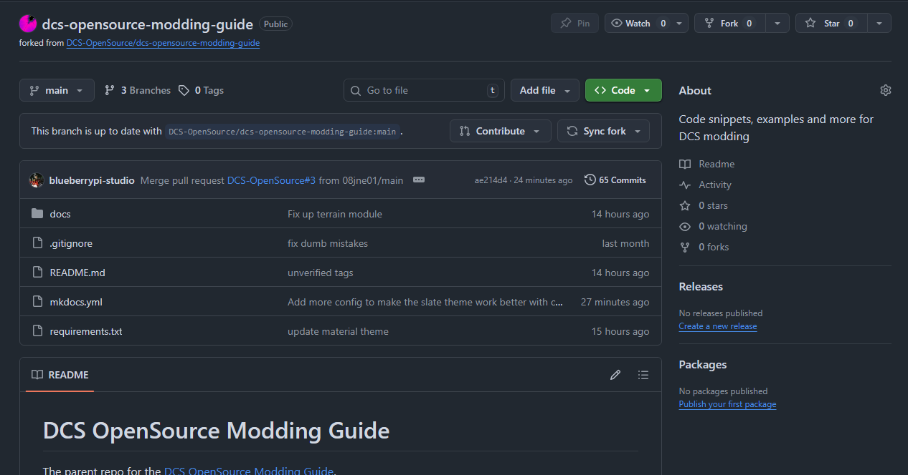
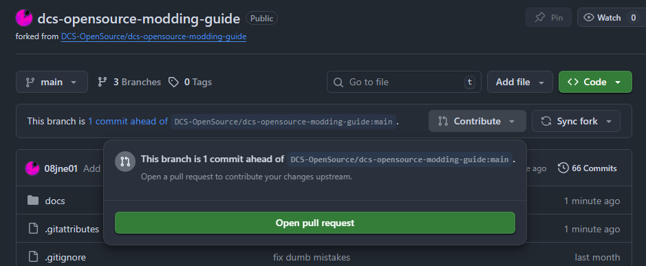

# Contributing

## Creating a Fork

On the Open Source Modding Guide discord click the fork button.

Then on the fork page click create fork, it should list your username under owner.

You will then have a new repository on your account.

## Editing your Fork

You can make any normal changes as if it were your repository. If you know how to use git you can clone your fork and edit it locally. If you don't you can edit directly on the github page and it will provide nice markdown previews.

## Pull Request

Once you have changes on your fork you can submit a pull request to have these changes merged back to the main repository.

You will see the changes saying your fork is ahead of the main repository you can hit contribute and create a pull request.

Press open pull request. A pull request is just a review where the main contributers can comment on your changes and if there need to be any adjustments to merge your changes properly.

Add a useful description so the reviewers know what is being changed. If you need to make further changes you can just commit them to your fork like normal and they will appear on the contributing page.

If your changes are then approved the main contributers will merge your repository into the main repository and you will have contributed to the project!
