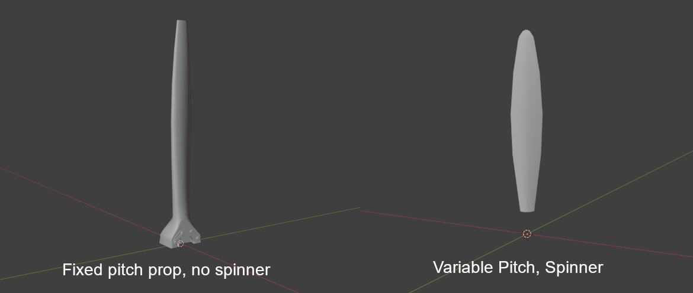
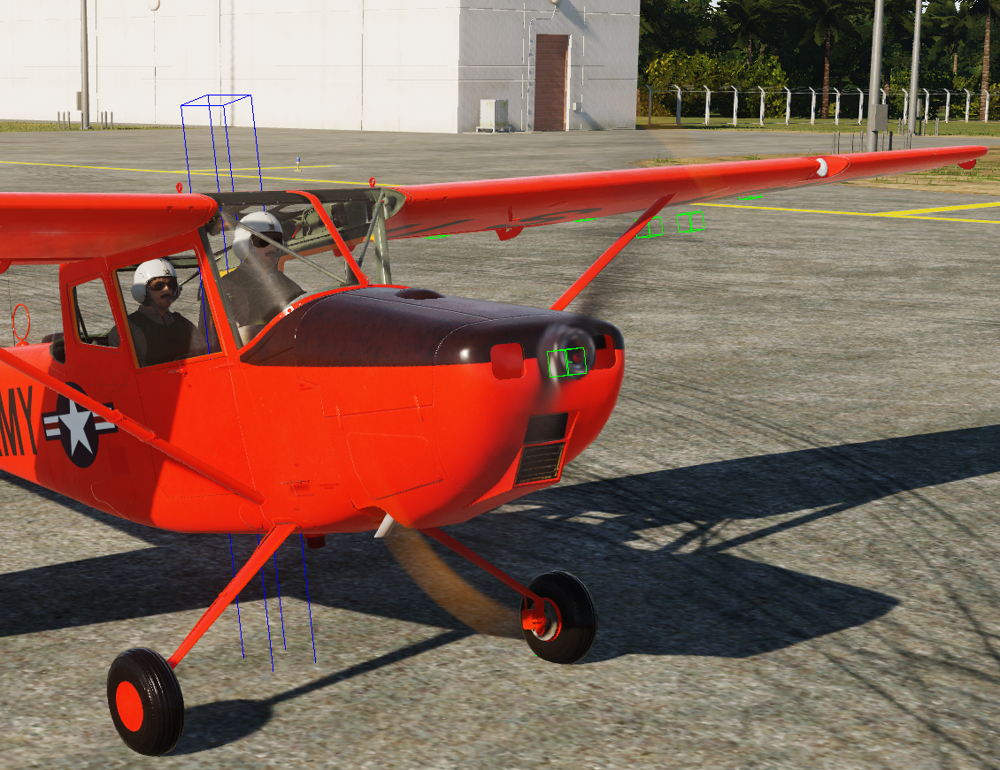

# Prop Blur

## Model Kurulumu

Prop Blur yapılandırmak için modelinizi aşağıdaki arg'larla gereken şekilde animasyonlandırın:

| Arg | Açıklama | Değerler | Animasyon |
|-----|----------|----------|-----------|
| 407 | Prop dönüşü | -1 ile 1 | Saat yönünün tersine 720 derece |
| 413 | Prop pitch | Değişir | TF-51 veya F4-U referansı |
| 475 | Prop kanadı görünürlüğü | 0 ile 1 | Kanatlar yalnızca 0'da görünür |

Sonra prop mesh'inizi başka bir Blender dosyasına veya Max dosyasına kopyalayın ve prop merkezini model orijiniyle hizalayın.

Ardından mesh'in büyük kısmını kaldırıp yalnızca prop'un tek bir kanadını bırakın. Bu, prop tipine göre değişebilir; aşağıda iki örnek vardır.



Prop'un yalnızca tek materyali olduğundan ve materyal adının ana EDM'inizdeki prop materyaliyle eşleştiğinden emin olun. Böylece prop blur, kanatlarınızla aynı texture'ı kullanır.

Bu dosyayı `.FBX` olarak export edin ve shapes klasörünüze veya projenizde mount edilmiş herhangi bir shape klasörüne koyun. Ardından sonraki adıma geçin.

---

### Texture önerisi

!!! Note
    Aşağıdaki notlar, blur görünümünün bu kadar iyi görünmesi için gerekenleri nazikçe paylaşan Mag3'ün 3D sanatçısından alınmıştır.

Aslında birçok faktör var. F4U'nun değişken pitch'li kanatları ve yaklaşık 13 feet çapı var. Bu, tüm açılarda kalınlık hissi veren bir görünüm oluşturuyor.

İkinci olarak, EDM'de uygulanan materyalin FBX ile aynı olduğundan emin olun. PBR renk değerleri de doğru olmalıdır.

Siyah için ModelViewer içinde mavi görünüp görünmediğini kontrol edin (F8 fonksiyon tuşuna basın).
Eskitme efektleri mavi görünmesine neden olabilir; bunun dışında düz/mat kaplamalı nesnelerde siyaha veya çok koyu maviye daha yakın olmalıdır.
HSB değerleriyle 0*, 0%, 17% olarak ayarlayıp oradan ilerleyin.

Pembe veya turuncuysa onların da ayarlanması gerekir. Saf renkler ModelViewer'da (F8) gri görünmelidir.

Saturasyonu 100%'den uzak tutmaya çalışın; shader için herhangi bir RGB değerinin 100% olması da iyi değildir.
HSB, Turuncu: 13*, 80%, 65% - 75% öneririm. Texture üzerinde koyu görünür ama sorun değildir.
HSB, Beyaz: 0*, 0%, 65% - 74%

Son olarak, collision modelinin rotation Arg numarası 370 olmalıdır; aralık 0...1 ve dönüş 360*. Ana model ise 407 kullanır.

---

## Lua Kurulumu

`plane.lua` içinde `propellorShapeType` ve `propellorShapeName` değerlerini aşağıdaki gibi tanımlamanız gerekir:

```lua
O1_BirdDog =
{
	Name 				=   'O-1E',
	DisplayName			= _('O-1E Bird Dog'),

	Shape 				= "O-1E",
	propellorShapeType  = "3ARG_PROC_BLUR",
    propellorShapeName  = "o1_blade.fbx",
```

Ayrıca `SFM_Data/engine` tablonuzda şu alanları tanımladığınızdan emin olun:
```lua
prop_direction      = 1,    -- pos rotates cw looking fwd neg is ccw
prop_pitch_min      = 26.0, -- prop pitch min, degrees
prop_pitch_max      = 82.0, -- prop pitch max, degrees
prop_pitch_feather  = 90.0, -- prop pitch feather position, degrees if feather < prop_pitch_max no feathering available
prop_blades_count   = 2,
prop_locations      = {
	{2.257, 0.03558, 0},    -- roll, yaw, pitch angle in tangent value
},
```

### 3ARG_PROC_BLUR

!!! Note
    * Bunu pitch ile test etmedim; yalnızca sabit pitch'li bir prop ile denedim.
    * Aşağıdaki bölüm bir blur sheet'e referans verir. Bunu ModelViewer'da çalıştıramadım, ancak oyun içinde test edebilirsiniz.

`3ARG_PROC_BLUR`, modelde üç draw arg bekler:

| Arg | Fonksiyon | Açıklama |
|-----|-----------|----------|
| A | RPM / Phase | Dönüş/blur miktarını sürer |
| B | Blur Visibility / Blend | RPM yükseldikçe kanat görünümünü blur'a geçirir |
| C | Aux / Alpha | Blur sheet için ek kontrol |

Bu arg'lar yoksa veya EDM içinde yüksek değerde takılı kalmışsa kalıcı bir disk görürsünüz. ModelViewer (EDM) içinde hızlı kontrol listesi:

Prop'un 3 ayrı draw argument kullandığını doğrulayın. Animation panelinde RPM'i döndürün ve üçünün de değiştiğini kontrol edin.

Statik blade mesh ve blur sheet olduğundan emin olun; her birinin görünürlüğü bu arg'lara bağlı olmalıdır (blade düşük RPM'de görünür, blur yalnızca eşik üstünde görünür).

---

### 2ARG_BLUR

Yalnızca blur sheet'iniz varsa ve statik kanatlar yoksa, sıfır RPM'de her zaman disk gibi görünür.
3 arg'lı sisteme ihtiyacınız yoksa Lua'da daha basit bir moda geçin, örneğin:

```lua
propellorShapeType = "2ARG_BLUR"
```

EDM içinde yalnızca iki draw arg bağlayın (static/blur). Ancak gerçek çözüm, EDM arg bağlantılarını düzeltip 3ARG sisteminin çalışmasını sağlamaktır.

Prop'un yalnızca görsel amaçlı olduğu AI-only uçaklarda en kolay yöntem şudur:

```lua
propellorShapeType = "static"
propellorShapeName = "tbm_avenger_blade.FBX"
```

Bu şekilde DCS, prop mesh'ini arg-driven blur olmadan olduğu gibi çizer.
Her zaman sabit duran prop gibi görünür; sahte dönüş olmaz; ancak "kalıcı disk" sorununu tamamen önler.

`1ARG_BLUR` kullanıp `shape_table_data` içindeki herhangi bir uygun dummy arg'a bağlayabilirsiniz; hareket etmesi bile gerekmez.
Veya statik bırakıp mesh için bulanık bir texture yaparak her zaman "motion smear" gibi görünmesini sağlayabilirsiniz.

Gerçekten dönmeye başladığında kanatlardan blur'a geçmesini istiyorsanız, EDM'de ModelViewer / 3ds Max üzerinden iki prop arg'ı eklemeniz gerekir:

Bir arg hızda statik kanatları gizler.
Bir arg hızda blur mesh'i gösterir.

Bu `2ARG_BLUR` kurulumudur ve DCS'in desteklediği en basit dinamik çözümdür.

---

## EFM Kurulumu

Aşağıdaki kodu diğer `ED_FM` fonksiyonlarınızla birlikte ana cpp dosyanıza eklemeniz gerekir.
Özellikle `ed_fm_get_param` içine eklenmelidir.
Bu değerleri doğru ayarlamak prop blur'un düzgün çalışmasını sağlar.

```cpp
switch (index)
	{
	case ED_FM_ENGINE_1_THRUST: // Thrust of engine in newtons, [N]
		return Prop.getThrust();
	// case ED_FM_ENGINE_1_RELATED_THRUST: /// Related thrust in relation to "max" or also called "dry thrust" thrust of that engine
	// 	return ??? for now, idk what max thrust is right now;

	case ED_FM_ENGINE_1_RPM: 			// Engine Fan RPM (fan RPM for turbofan, propeller RPM for turboprop, etc.)
	case ED_FM_PROPELLER_1_RPM:			// Propeller RPM, for helicopters this is main rotor RPM
	case ED_FM_ENGINE_1_CORE_RPM:  		// 0..RPMmax Engine and prop sound
		return Engine.getRPM();
	case ED_FM_ENGINE_1_RELATED_RPM:    // [0-1]
    	return Engine.getRPMFraction();
	case ED_FM_ENGINE_1_CORE_RELATED_RPM:  // [0-1] displayed as RPM% in 2D F2 view
		return Engine.getRPMFraction();
	case ED_FM_ENGINE_1_FAN_PHASE:      // [0 - 2pi] Required to get the arg 407 to trigger the spin at low RPM
		return Prop.getFanPhase();
	}
```

!!! Note
    * Bunların daha ayrıntılı açıklamaları için EFM API içindeki `FM/wHumanCustomPhysicsAPI.h` dosyasına bakın.
    * Bazı motorlarda engine RPM ve prop RPM farklı olabilir; bu yüzden yukarıdaki parametrelere verdiğiniz değerlerin değişmesi gerekebilir.
    * Yukarıdaki koddaki `Prop.getThrust();` gibi fonksiyonlar simülasyonumdan veri çeken özel fonksiyonlardır; hazır gelmezler.

---

## Sonuç

Yukarıdakileri doğru yaptıysanız buna benzer bir şey görmelisiniz.


