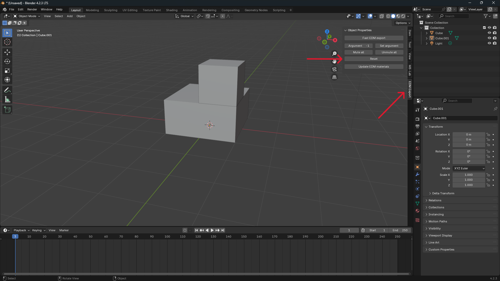
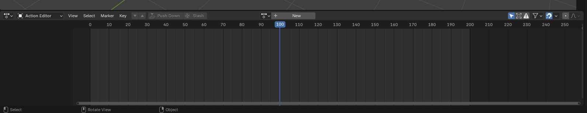
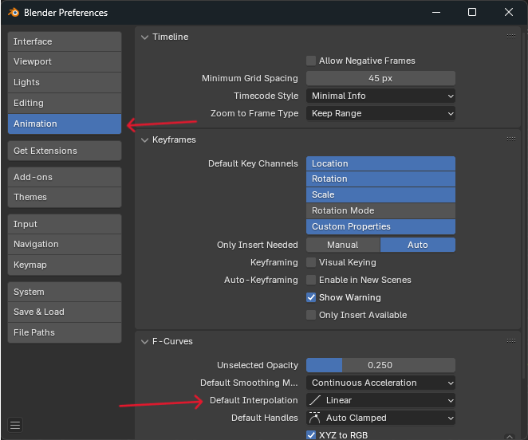
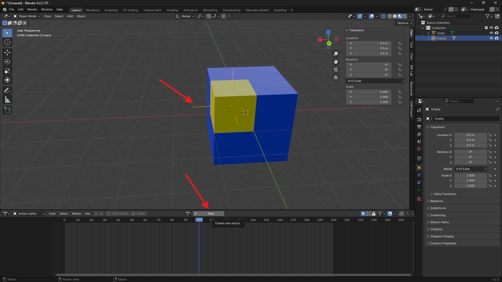
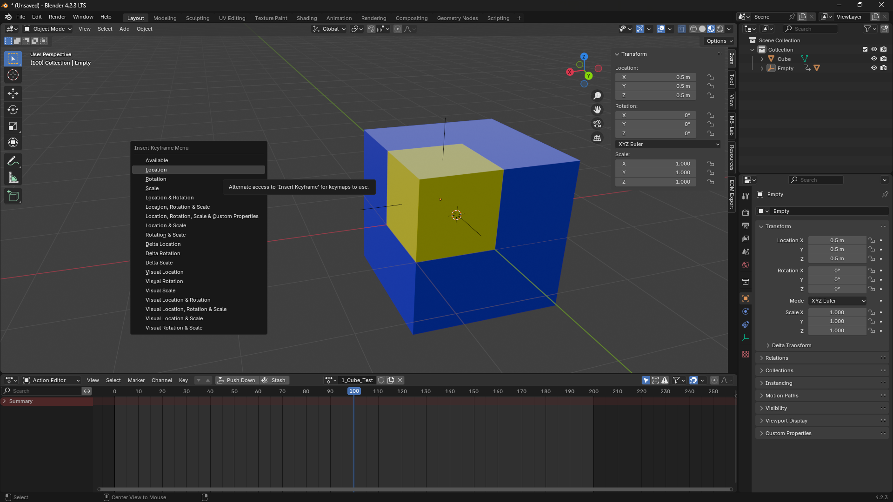
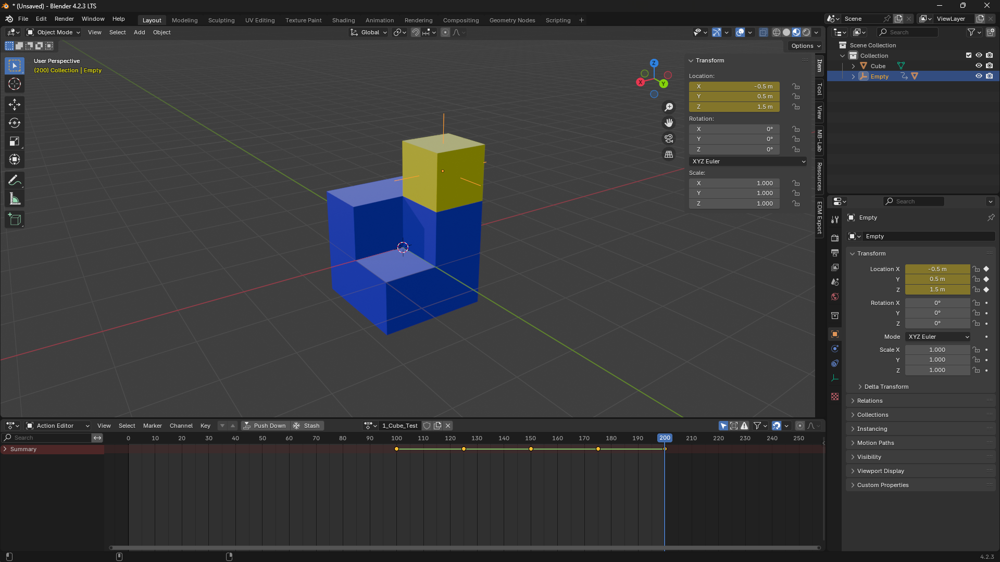
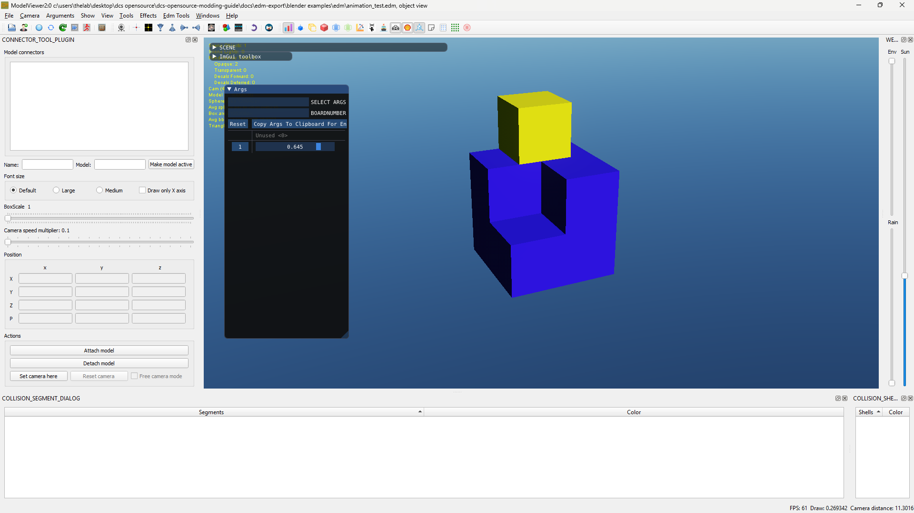
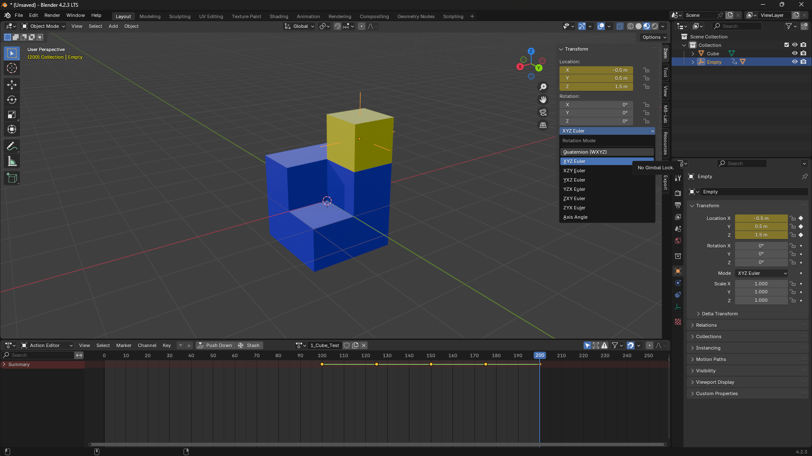

# Animasyonlar

## Temel Kurulum

### Timeline

EDM Export Properties Panel'i açın ve reset düğmesine tıklayın.
Bu, Blender timeline'ını gereken formata yapılandırır.

Timeline aralığının 0-200'e değiştiğini ve timeline marker'ın 100'e oturduğunu görmelisiniz.

DCS animasyonu için Action Editor'ü öneririm. Dope sheet seçilip mode Action Editor olarak değiştirilerek bulunabilir.

### Varsayılan Interpolation

EDM formatı keyframe'ler arasındaki boşluğu linear kabul eder; ancak Blender varsayılan olarak böyle yapmaz.
Bunu değiştirmek için `Edit > Preferences` yoluna gidin, `Animation` seçin ve `Default Interpolation` değerini `Linear` yapın.

### Animasyonlara başlamadan önce

Animasyonlara başlamadan önce rotation ve scale değerlerini apply etmek önemlidir. Location'ın apply edilmesi gerekmez.

!!! Warning
    Bunu yapmazsanız ortaya çıkan export'ta Blender içinde görünmeyen tuhaf translation'lar bulabilirsiniz.

---

## Animasyon Oluşturma

Animasyonlandırmak istediğiniz nesne üzerinde, rotation axis veya nesnenin merkezi gibi ilgili bir noktaya Empty oluşturun.

Animasyonlandırılacak mesh'i `CTRL + P` -> `Object` ile empty'ye parent yapın.

Empty'yi seçin, ardından Action Editor'ün üst kısmındaki `New` düğmesine tıklayın.

Animation Action adını (new düğmesinin yerine gelen textbox'a tıklayarak) istediğiniz arg numarası, ardından alt çizgi ve açıklama olacak şekilde verin.
Örneğin `1_Cube_Test`, animasyonu EDM dosyasında arg 1'e ekler. **İstenen arg numarası adın başında olmak zorundadır; sonrasındaki metin sonucu değiştirmez.**

Sonra timeline slider 100'deyken *(DCS Arg değeri 0)* `K` tuşuna basın (Blender 3.6 `I` kullanır) ve istediğiniz tipte bir keyframe ekleyin.

Ardından timeline slider'ı 200'e taşıyın *(DCS Arg değeri 1)* ve başka bir keyframe yerleştirin. Aşağıdaki görseldeki gibi araya başka keyframe'ler de ekleyebilirsiniz.

EDM'e export edin, dosyanızı ModelViewer'da açın. Mesh'inizi ve animasyonunuzu slider olarak gösteren `Args` adlı bir pencere görmelisiniz. Animasyonunuzu test etmek için slider'ı sürükleyin.

!!! Warning
    **Rotation Animasyonları**
    Rotation animasyonu yapıyorsanız herhangi bir keyframe eklemeden **önce** rotation değerini `Quaternion (WXYZ)` olarak ayarladığınızdan emin olun (aşağıdaki görseldeki gibi). Aksi halde EDM dosyanızda Blender ile eşleşmeyen rotation fark edebilirsiniz.

    180 derece veya daha büyük dönüş yaparken keyframe'leri 90 derecelik aralıklarla ekleyin; aksi halde dönüşünüz yanlış yöne gidebilir.

    

### Demo Dosyasını İndir

**Animation Test**
[animation.blend](../../EDM-Export/Blender%20Examples/Blend/animation.blend)

---

## Skin Animations

ED, NLA track'leri ve armature başına birden fazla arg desteği ekledi; dokümantasyon daha sonra gelecek.

!!! Warning
    * Deforming mesh başına en fazla 4 bone
    * Bounding box elle tanımlanmalı; yoksa export edilmez
    * Armature modifier adının Armature olması gerekir; başka bir şey olmamalıdır (root bone değil, modifier)
