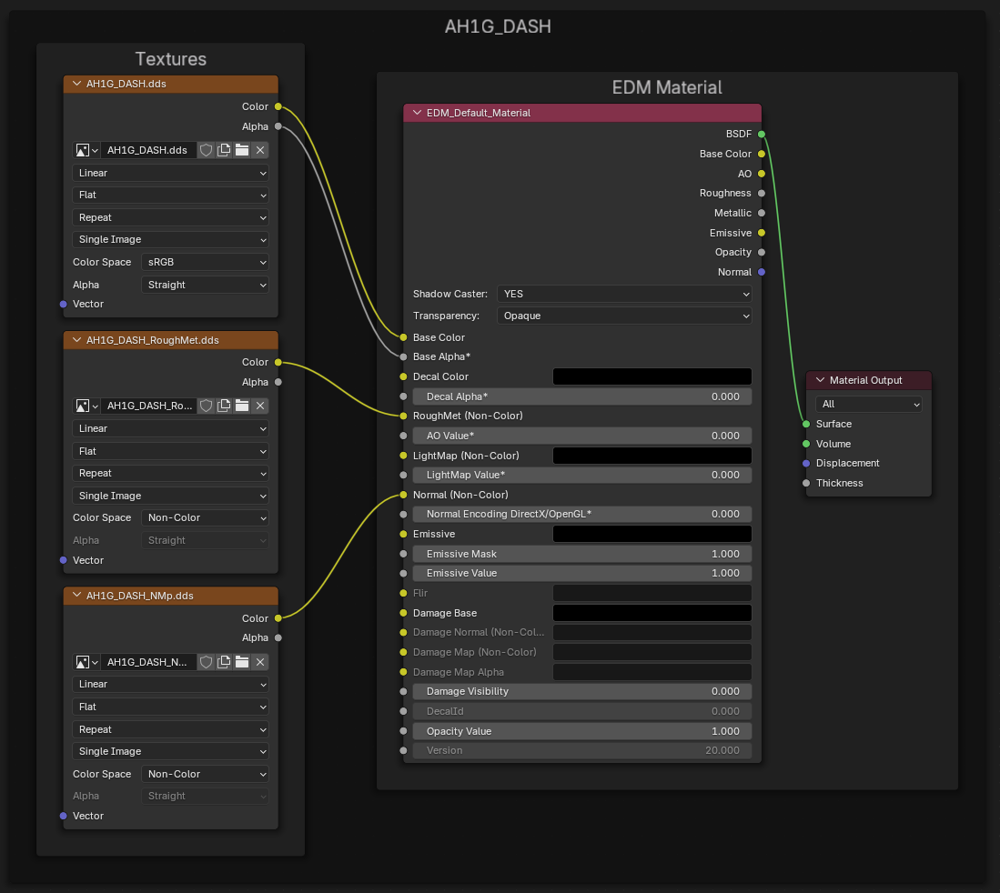
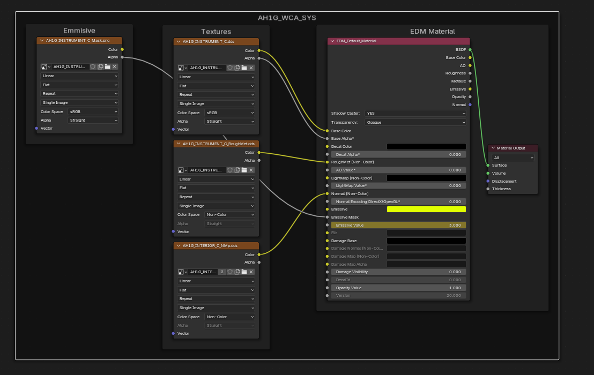
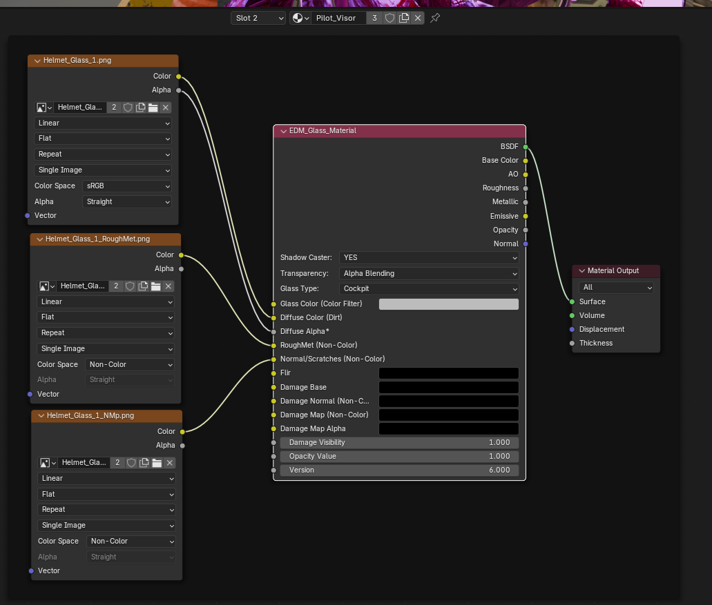

# Materyaller

Materyaller EDM'e export işleminin temel parçasıdır. Farklı kullanım alanlarına sahip 6 ayrı materyal vardır.

| Materyal | Açıklama |
| --- | ---- |
| [Default Material](#default-material-node) | En yaygın olanıdır; tüm katı mesh'lerde bulunur |
| [Glass Material](#glass-materials) | Enstrüman camı veya canopy gibi şeffaf mesh'ler |
| [Mirror Material](#mirror-materials) | Yalnızca ayna yüzeyine uygulanır |

## Default Material Node

### Varsayılan Kurulum

!!! Note
    RoughMet ve Normal node'larının `Color Space` alanlarını `Non-Color` yapmak, Blender'ın texture'ları doğru render etmesini sağlar.
    Ancak bunu ayarlamamak ortaya çıkan EDM export'unu etkilemez; bu yüzden güvenle yok sayılabilir.

### Emissive Texture'lar

Emissive Texture'lar default materyallerin bir uzantısıdır.

Bu node kurulumu arkadan aydınlatmalı paneller vb. yapmak içindir. Emissive mask, ışığın geçtiği yerlerde beyaz olan alpha map'e sahip bir texture'dır. Bunun örnekleri eklentinin demo dosyalarında görülebilir.

Bu parlaklık animasyonlandırılabilir; yine demo dosyalarına bakın.

!!! Note
    TODO Bunu animasyonlar dahil daha ayrıntılı anlat. Animasyonların materyal başına değil, mesh başına olduğunu not et; bu kullanışlıdır.

---

## Glass Materials

Aşağıda glass material node örneği vardır. Glass material node, [default material](#default-material-node) ile aynı 3 texture'ı alır.

!!! Warning
    Base Colour değerinin Glass Colour'a değil diffuse colour'a gittiğine dikkat edin. Yazım sırasında Glass Colour'un ne yaptığından emin değilim, ancak eklentinin demo dosyalarında bir örnek var.

---

## Mirror Materials

---
