# DCS'e Mesh Export Etme

## Materyali Hazırlama

İlk mesh'inizi `.edm` formatına export etmek için aşağıdaki gibi boş bir Blender cube ile başlayın.

Modelinizin "Front" yönü pozitif X'e bakar; bu yüzden aracınızın veya uçağınızın burnunu pozitif X'e doğru hizaladığınızdan emin olun.

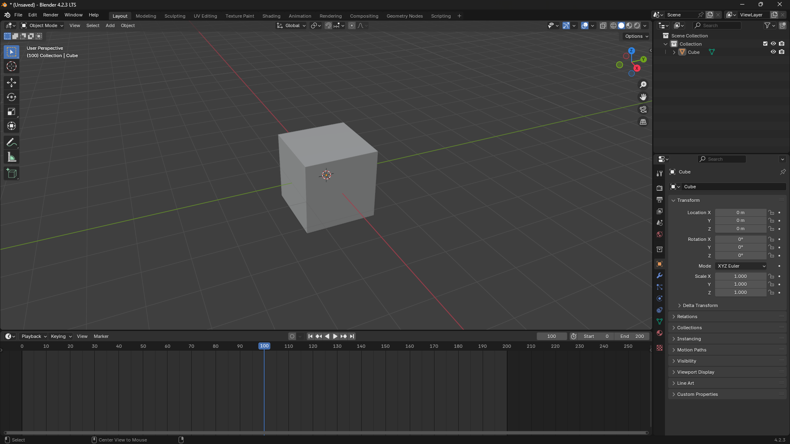

!!! Note
    Mesh'inizin Rotation ve Scale değerlerinin uygulanmış olduğundan emin olun. Bunu mesh'i seçip `CTRL + A` tuşlarına basarak ve `Rotation and Scale` seçerek yapabilirsiniz.

Shading sekmesine geçin. Cube varsayılan olarak materyale sahip değilse bir materyal oluşturun.

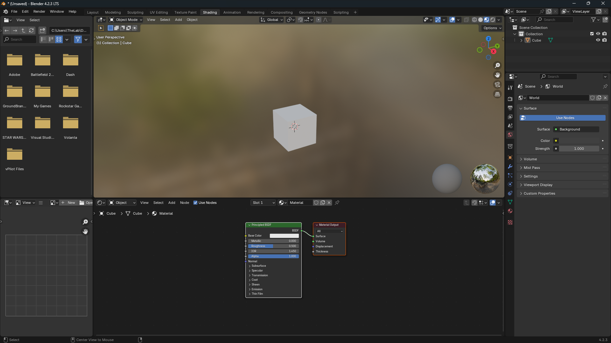

Sonra materyal node'larını EDM Materials ile yapılandırmamız gerekir.

Önce varsayılan *Principled BSDF* node'unu kaldırın, ancak *Material Output* node'unu **bırakın**.

Ardından `SHIFT + A` tuşlarına basarak veya Node Editor içinde `Add` seçeneğine tıklayarak EDM Materials > Material - Default yoluna gidin.

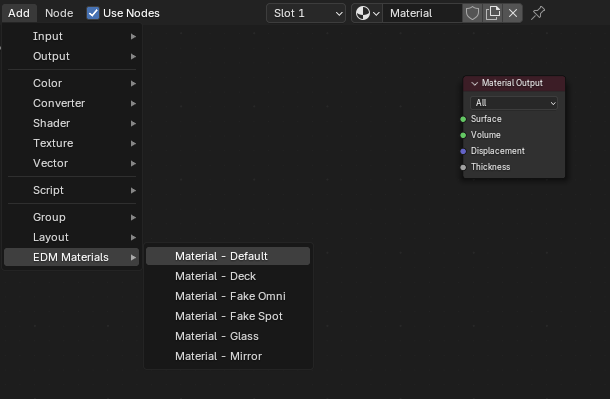

*EDM_Default_Material* node'u yerindeyken EDM materyalinin BSDF noktasını *Material Output* içindeki Surface noktasına bağlayın. Aşağıda bunun bir örneği görülebilir.

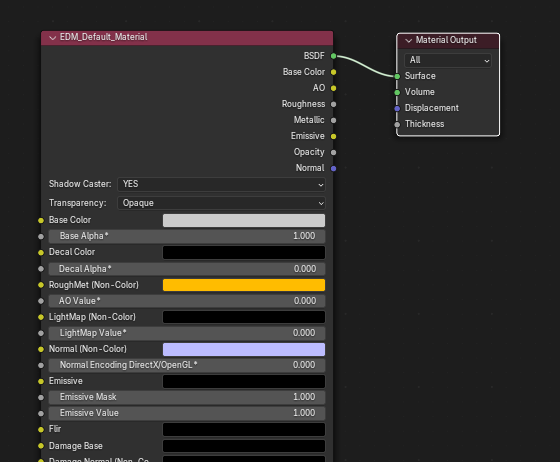

---

## EDM'e Export Etme

Artık cube'u `.edm` dosyasına export etmeye hazırız.
`File > Export > Eagle Dynamics Model (.edm)` yoluna gidin.
Ardından dosyanızı adlandırın ve *export to EDM* düğmesine tıklayarak istediğiniz konuma kaydedin.

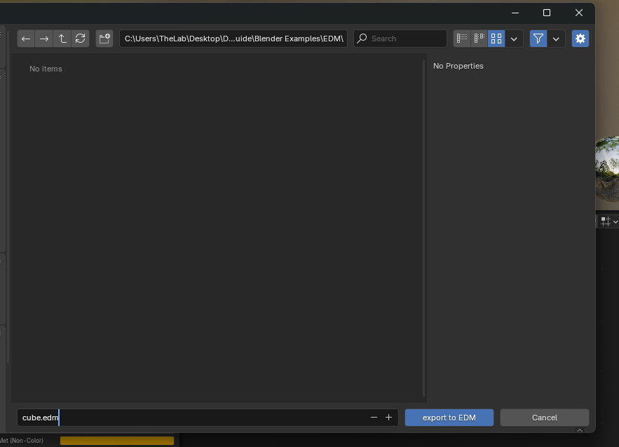

## ModelViewer'da Açma

ModelViewer'ı açın ve `File > Load Model` yoluna gidin veya `CTRL + N` kullanın.
EDM dosyanıza gidin, seçin ve load düğmesine basın.

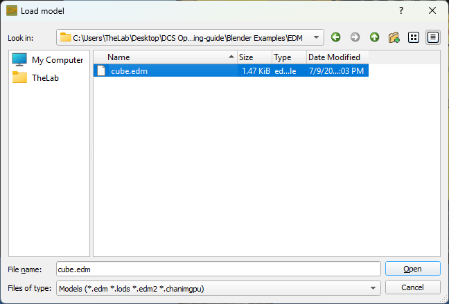

Aşağıdaki görsele çok benzeyen beyaz bir cube görmelisiniz.

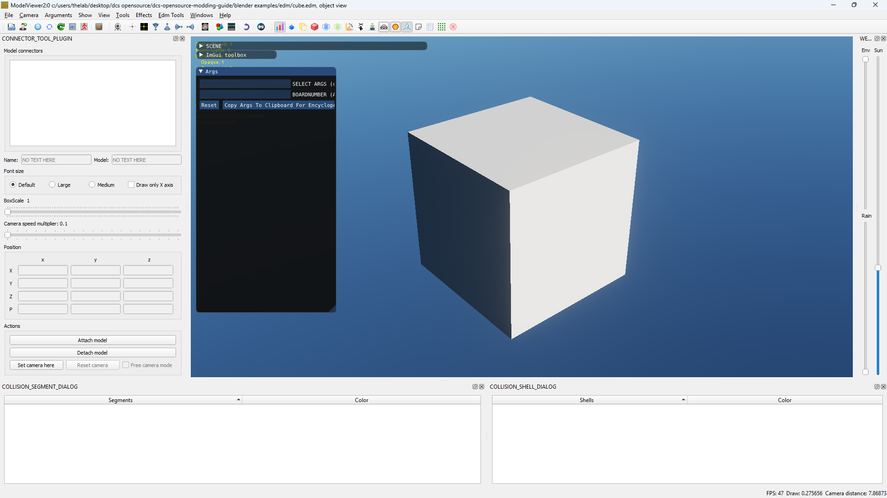

## Birden Fazla Mesh/Materyal

EDM materyali atanmış herhangi bir nesne DCS'e export edilir. İkinci bir mesh eklerseniz mevcut EDM materyalinizi atayın veya yeni bir tane ekleyin; DCS'e export edilir.

## Mesh Başına Birden Fazla Materyal

ED Exporter, mesh başına birden fazla materyali destekler. Özel bir kurulum gerekmez; mesh içindeki tüm materyallerin EDM materyali olarak yapılandırılması yeterlidir.

## Texture Ekleme

Node editor'e dönün ve `Add > Texture > Image Texture` yoluna gidin.
Ardından image texture üzerindeki Color ve Alpha noktalarını EDM Material üzerindeki Base Color ve Base Alpha noktalarına bağlayın.
Image Texture Node içinde görselinizi seçin. Projeniz aşağıdaki görsele benzer görünmelidir.

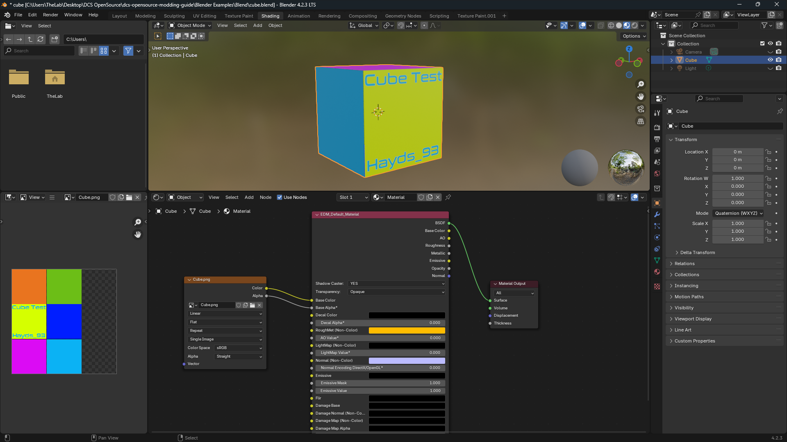

[EDM'e Export Etme](#edme-export-etme) adımlarını tekrarlayın.
Ardından ModelViewer'ı kapatıp yeniden açın ve EDM dosyanızı tekrar yükleyin.

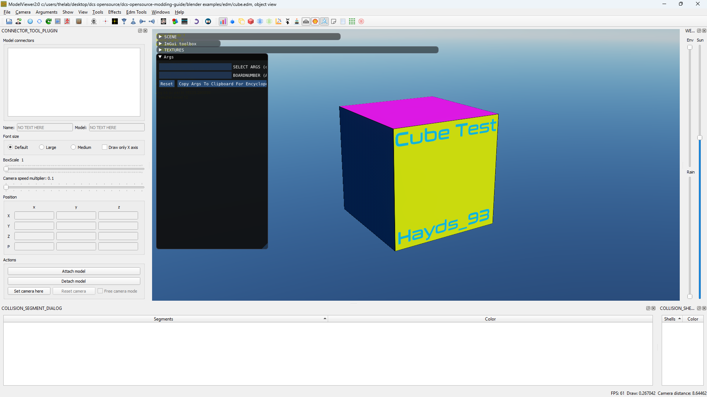

!!! Warning
    Texture'lar doğru şekilde mount edilmedikçe ModelViewer içinde görünmez.

Tipik çalışan dizin yapısı şöyledir: (bu çalışmazsa Discord üzerinden Hayds_93'e DM atın, güncellerim)

```
Project/
├─ Shapes/
│   └─ cube.edm
└─ Textures/
    └─ cube.png
```

## Blender Proje Yapısı

Zorunlu olmasa da tüm LOD'ları (Level of Detail) ve collision modelini tek bir `.edm` dosyasına bake edebilirsiniz.

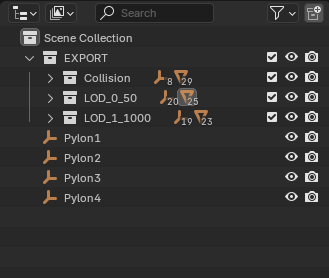

Bir `EXPORT` Collection ile başlayıp collision için alt collection'lar ve `LOD_{LOD_NUMBER}_{LOD_DISTANCE_IN_M}` (ör. `LOD_0_50`) alt collection'ları oluşturun.
Her alt collection'da mesh'in bir kopyası olmalı; animasyon veya parent paylaşmamalıdır. Animation empty'lerini duplicate edin ve action'ları yeni empty'lere yeniden uygulayın.

---

## Yaygın Hatalar

### Index out of range hatası

Buna benzer bir hata alırsanız:

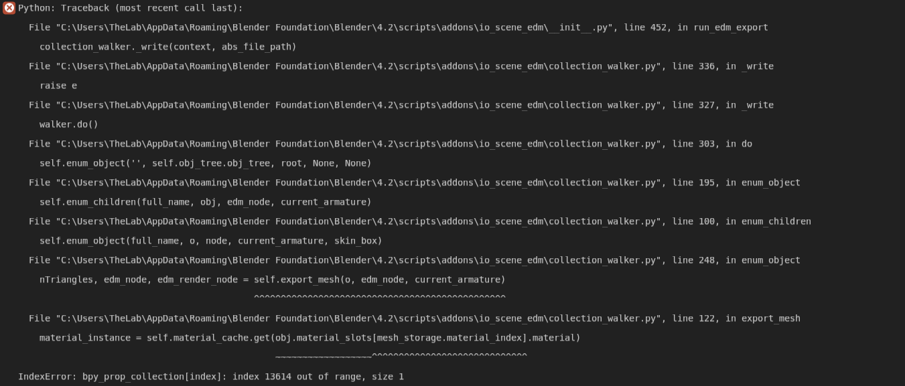

Bu hata büyük olasılıkla Blender sürümleri arasında dönüştürmeden kaynaklanan materyal bozulmasıyla ilgilidir. Çözmek için:

* Blender Python console'u açın ve şunu çalıştırın:
```py
for obj in bpy.context.scene.objects:
    print("Processing object:", obj.name)
    if obj.type == 'MESH':
        # Set the active material index on the object
        obj.active_material_index = 0
        # Validate material indices on the mesh data
        obj.data.validate_material_indices()
```
* Mesh'inizi yeniden export edin.
