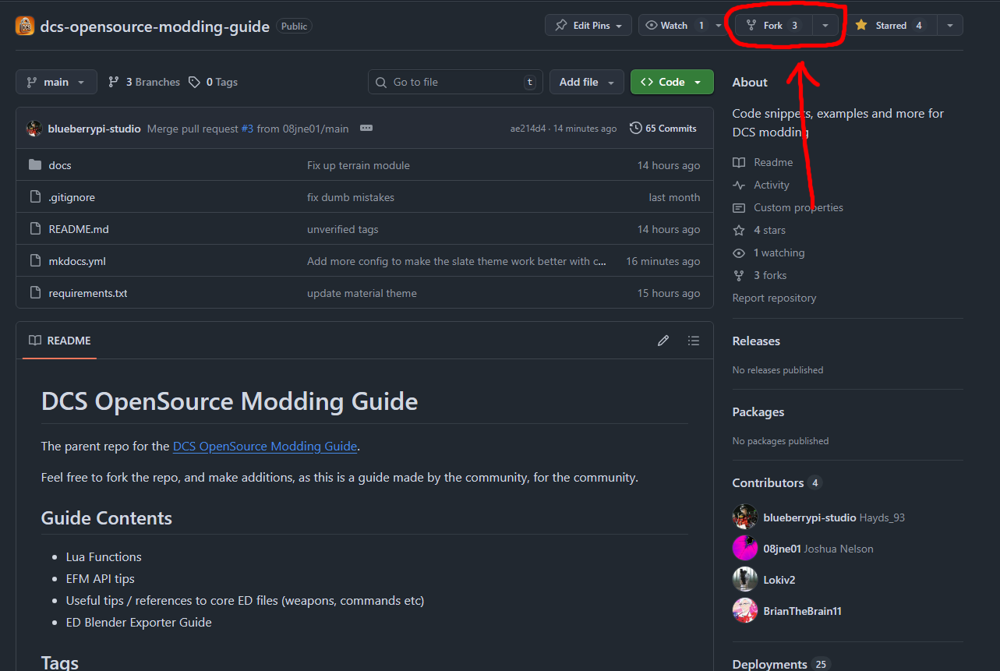
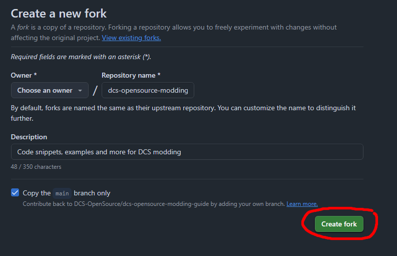
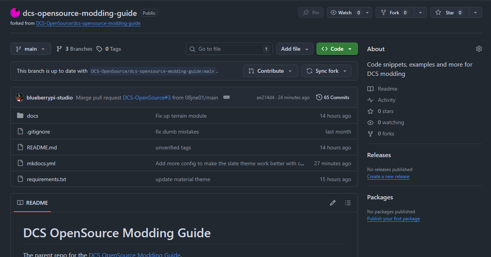
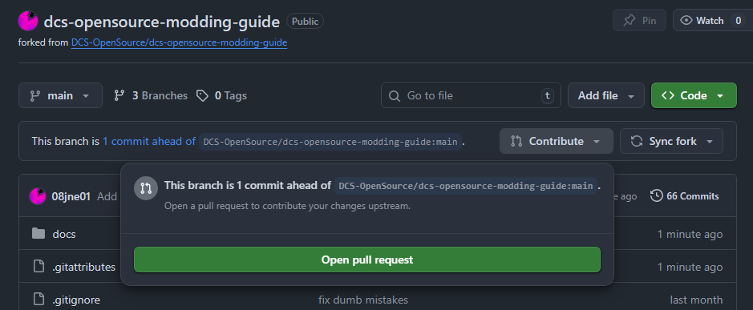
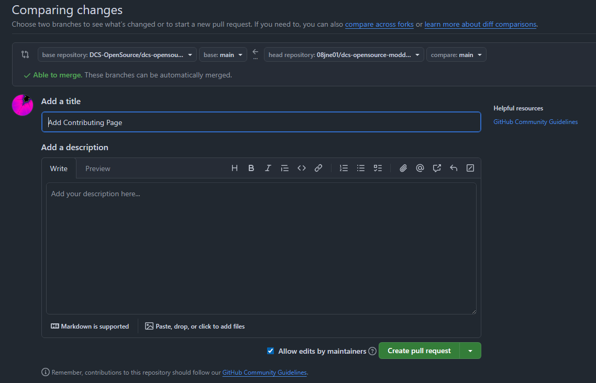

# Katkıda Bulunma

## Fork Oluşturma

Open Source Modding Guide Discord'unda fork düğmesine tıklayın.

Ardından fork sayfasında create fork düğmesine tıklayın; owner altında kullanıcı adınız görünmelidir.

Hesabınızda yeni bir repository oluşacaktır.

## Fork'unuzu Düzenleme

Kendi repository'nizde çalışıyormuş gibi normal değişiklikler yapabilirsiniz. Git kullanmayı biliyorsanız fork'unuzu klonlayıp yerelde düzenleyebilirsiniz. Bilmiyorsanız GitHub sayfası üzerinden doğrudan düzenleyebilir ve Markdown önizlemelerinden yararlanabilirsiniz.

## Pull Request

Fork'unuzda değişiklik yaptıktan sonra bu değişikliklerin ana repository'ye alınması için bir pull request gönderebilirsiniz.

Fork'unuzun ana repository'den ileride olduğunu gösteren değişiklikleri göreceksiniz; contribute düğmesine basıp pull request oluşturabilirsiniz.

Open pull request düğmesine basın. Pull request, ana katkıcıların değişikliklerinize yorum yapabildiği ve gerekirse düzgün birleştirme için düzenleme isteyebildiği bir inceleme sürecidir.

İnceleyenlerin neyin değiştiğini anlayabilmesi için yararlı bir açıklama ekleyin. Daha fazla değişiklik yapmanız gerekirse bunları normal şekilde fork'unuza commit edebilirsiniz; değişiklikler katkı sayfasında görünecektir.

Değişiklikleriniz onaylanırsa ana katkıcılar repository'nizi ana repository ile birleştirir ve projeye katkıda bulunmuş olursunuz.
